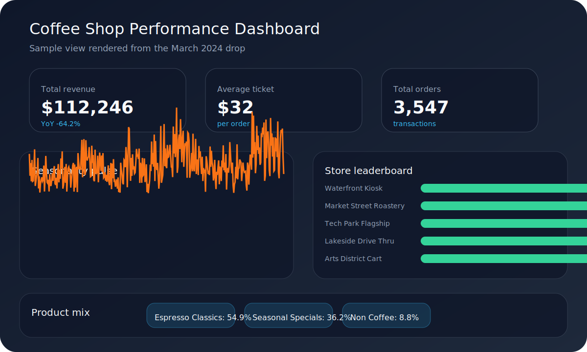

# Coffee Shop Performance Dashboard



## Overview
The dashboard equips store managers with a single control tower for the curated `coffee_sales` dataset. It highlights how each location, product line, and seasonal window contributes to revenue so that merchandising, staffing, and promotional decisions can be made with confidence. By surfacing actionable KPIs in real time, the tool replaces static spreadsheet reporting and accelerates conversations around mix optimization, seasonal menu planning, and staffing.

## Dataset
- The canonical dataset (`Data/coffee_sales.csv`) and column descriptions live in [`Data/README.md`](Data/README.md).
- Analysts can swap in a fresh drop without touching the code base so long as the schema remains stable.

## Features
- **KPI cards:** Track total revenue, average ticket, and total orders with YoY deltas.
- **Seasonal trends:** Line chart shows daily revenue patterns to highlight peak days and shoulder periods.
- **Store performance:** Leaderboard ranks the seven concept stores (mapped from weekdays) by revenue and orders, plus a geographic scatter for regional coverage.
- **Product mix:** Treemap visualizes how each beverage and category contributes to sales and margin.

## Tech Stack
- **Python 3.11** for orchestration.
- **Streamlit** for the interactive UI, filtering, and layout.
- **pandas** for feature engineering and aggregations.
- **Plotly Express** for the line, treemap, scatter geo, and profitability visuals.

## Repository Structure
```
├── Data/
│   ├── README.md            # Dataset documentation
│   └── coffee_sales.csv     # Sample fact table
├── app.py                   # Streamlit entrypoint
├── app_utils/
│   └── data_processing.py   # Feature engineering helpers
├── scripts/
│   ├── data_check.py        # Lightweight schema + quality gate
│   └── generate_dashboard_preview.py  # Creates the README preview image
├── assets/
│   └── dashboard-preview.svg
├── theme.py                 # Centralized color + typography theme
└── requirements.txt
```

## Setup
1. **Python version:** Use Python 3.11 (other 3.10+ versions generally work, but 3.11 is what the project targets).
2. **Create a virtual environment:**
   ```bash
   python3 -m venv .venv
   source .venv/bin/activate  # Windows: .venv\Scripts\activate
   ```
3. **Install dependencies:**
   ```bash
   pip install -r requirements.txt
   ```
4. **Launch the dashboard:**
   ```bash
   streamlit run app.py
   ```

## Usage
- Navigate the **Control Tower** sidebar to filter by date range, product categories, and regions. Streamlit caches data for snappy iterations.
- Use the KPI row to confirm revenue lift and average ticket changes before drilling into the visuals.
- The **Seasonality pulse** chart calls out weekday vs. weekend swings. Hover to inspect exact values for specific days.
- The **Store leaderboard** and **regional scatter** identify which storefronts need staffing or marketing support.
- The **Product mix** treemap highlights which beverages dominate and where you can experiment with seasonal specials.

## Data Refresh
1. Drop the new CSV into `Data/` (or point to an alternate path when running the script).
2. Validate the file before shipping to production:
   ```bash
   python scripts/data_check.py  # accepts an optional --path argument
   ```
3. If schema or business rules change, update `app_utils/data_processing.py` and rerun the Streamlit app to ensure visuals still render.

## Data Refresh Automation Ideas
- Schedule `scripts/data_check.py` in CI before every deployment.
- Store the validated CSV in an object store or database once the script passes.

## Testing
- **Data health:** `python scripts/data_check.py`
- **Unit tests:** `pytest` (add new tests under a `tests/` directory as you extend the data helpers or visual logic).

## Contribution Guidelines
1. Fork or branch off `main`.
2. Create focused commits (data prep, UI tweaks, documentation, etc.).
3. Accompany new features with doc updates and tests.
4. Open a pull request describing business value, screenshots/GIFs, and validation steps.
5. Tag stakeholders for review before merging.
